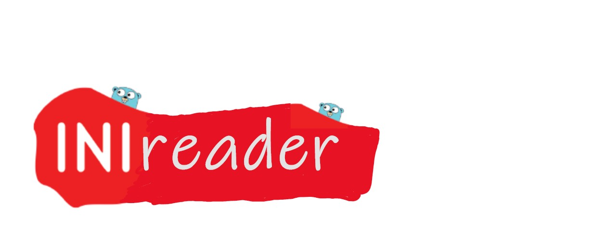

# INIreader


[](https://pkg.go.dev/github.com/chenguofan1999/inireader)
[](https://sourcegraph.com/github.com/chenguofan1999/iniReader)



Package inireader provides INI file read functionality in Golang.

### Looks familiar?

Yep, Referenced [INI](https://github.com/go-ini/ini) 

## Features

- Load configure info from ini file **by sections**
- Support description(comments), including multiple-line description
- Watch for file changes and reload
- Manipulate sections, keys and comments with ease.

## Installation

The minimum requirement of Go is unknown. Good luck!

```sh
go get github.com/chenguofan1999/inireader
```

### Update

Update as you please, we won't add new features anyway.

```sh
go get -u github.com/chenguofan1999/inireader
```

## Usage

An example here :

Now I got a repository including these files:

```
$ tree
.
├── login.ini
├── main.go
└── my.ini
```

*my.ini*

```ini
# possible values : production, development
app_mode = development

[paths]
# Path to where grafana can store temp files
data = /home/git/grafana


[server]
# Protocol (http or https)
protocol = http

# The http port  to use
http_port = 9999

# Redirect to correct domain if host header does not match domain
# Prevents DNS rebinding attacks
enforce_domain = 0
```

*login.ini*

```ini
[User1]

# user_name
name = yourName

# user_email
email = yourEmail

# user_password
password = yourPassword
```


*main.go*

```go
package main

import (
	"fmt"

	"github.com/chenguofan1999/inireader"
)

func main() {
	// Read .ini file directly by calling inireader.Load
	cfg := inireader.Load("my.ini")
	fmt.Println(".app_mode : ")
	fmt.Println("	Description: ", cfg.Section("").Descriptions["app_mode"])
	fmt.Println("	Value      : ", cfg.Section("").Key("app_mode"))

	fmt.Println("paths.data: ")
	fmt.Println("	Description: ", cfg.Section("paths").Descriptions["data"])
	fmt.Println("	Value      : ", cfg.Section("paths").Key("data"))

	// Watch for changes of a file and then load ini info
	// After running main.go please edit login.ini and save it
	var fl inireader.FileListener
	cfgLogin, err := inireader.Watch(fl, "login.ini")

	if err != nil {
		panic(err)
	}

	fmt.Println("User1.name")
	fmt.Println("	Description: ", cfgLogin.Section("User1").Descriptions["name"])
	fmt.Println("	Value      : ", cfgLogin.Section("User1").Key("name"))

	fmt.Println("User1.email")
	fmt.Println("	Description: ", cfgLogin.Section("User1").Descriptions["email"])
	fmt.Println("	Value      : ", cfgLogin.Section("User1").Key("email"))

	fmt.Println("User1.password")
	fmt.Println("	Description: ", cfgLogin.Section("User1").Descriptions["password"])
	fmt.Println("	Value      : ", cfgLogin.Section("User1").Key("password"))
}
```

Run it.
```sh
go run main.go
```


Result as follow, notice that the program has not ended yet, it is now runing `watch` function, waiting for *login.ini* to be edited.

```
$ go run main.go
.app_mode : 
        Description:  possible values : production, development
        Value      :  development
paths.data: 
        Description:  Path to where grafana can store temp files
        Value      :  /home/git/grafana
```

Now edit *login.ini* like this and save it ,

```
[User1]

# user_name
name = Luojun

# user_email
email = president@mail.sysu.edu.cn

# user_password
password = HowDoIKnow
```

New output comes out and program ends.

```
User1.name
        Description:  user_name
        Value      :  Luojun
User1.email
        Description:  user_email
        Value      :  president@mail.sysu.edu.cn
User1.password
        Description:  user_password
        Value      :  HowDoIKnow
$
```


## License

This project is under wtfpl license.  
See the [LICENSE](https://github.com/anak10thn/WTFPL) file for the full license text.